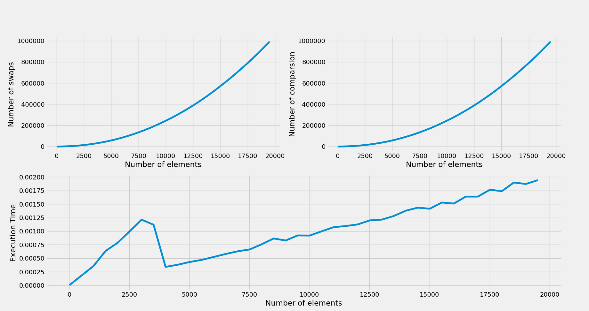

# Sorting Perfromance
  In this project we build an application, using C, to compare performance of the various sorting algorithms.

Performance can be measured by parameters such as-
- Execution time.
- Number of comparisons (for comparison-based sorting algorithms only).
- Number of read and write operations.

We will comparing the given sorting algorithm -

- Bubble Sort
- Merge Sort
- Selection Sort
- Insertion Sort
- Quick Sort
- Counting Sort

# Graphs 
Here we see the comparision of differernt sorting

## Bubble Sort

## Merge Sort

## Selection Sort

## Insertion Sort

## Quick Sort

## Counting Sort

## For running the shell script 
    run ./bash.sh